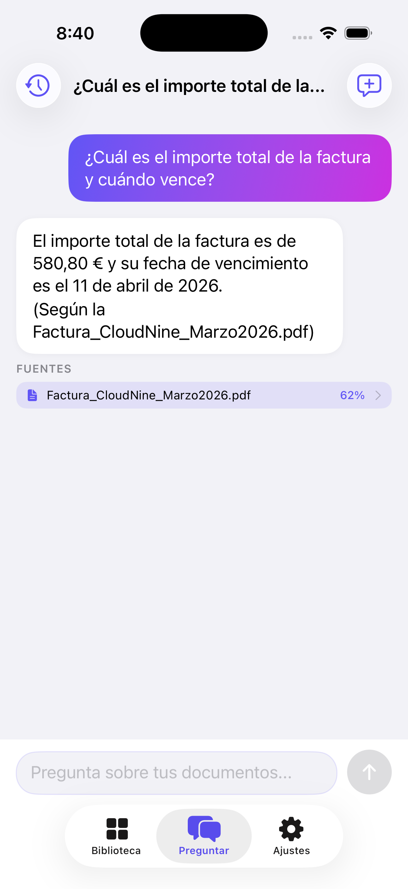

# DocumentBrain

**A local-first RAG search engine for your documents, built as an iOS app.** On-device embeddings, hybrid vector+keyword retrieval, a three-tier LLM fallback chain, and a security-hardened edge proxy — no server, no user data leaving the device except an authenticated, rate-limited call to the LLM itself.



You import files, the app extracts text, splits it into semantic chunks, generates vector embeddings, and then answers your questions in a chat interface with citations back to the source document. Invoices, boarding passes, tickets and contracts are automatically analysed to extract structured data — vendor, amount, flight route, seat, event details — which you can add to your calendar in one tap. Any QR/barcodes are detected so you can display them at full brightness directly from the app, and a full-text search lets you find the exact fragment of any document instantly.

### What this demonstrates

- **ML on-device**: multilingual CoreML embedding model (int4/int8-compressed) + a SentencePiece tokenizer written in Swift and verified token-for-token against Hugging Face — no cloud dependency for search itself.
- **Systems design under constraints**: hybrid retrieval, a 3-tier LLM fallback chain, and edge rate-limiting with Durable Objects for strong consistency — see [Design decisions](#design-decisions) for the trade-offs.
- **Security-conscious backend**: API keys never reach the client; device identity via Apple App Attest; layered, staged-rollout rate limiting. See [Security](#security).
- **Engineering discipline**: MVVM + repository pattern, 111 unit tests, a labelled [retrieval benchmark](#retrieval-evaluation) that turns "search feels better" into numbers, typed error handling — not just a demo that only survives the happy path.

---

## Problem

When your information is scattered across PDFs, document photos, spreadsheets and text files, retrieving a specific answer means opening multiple files and searching manually.

DocumentBrain lets you:

- centralize all your files in an organized library,
- group them in hierarchical folders,
- query the content in natural language from a chat interface,
- see exactly which fragment of which document each answer came from.

---

## Features

### Library & organization

- Import from the file system, camera/gallery, and Share Extension.
- **Hierarchical folders** with breadcrumb navigation, create, rename, delete, and move documents to any depth level.
- Document cards with thumbnail, processing status, and a retry action on error.
- Filters and sorting by name, date, and type.

### Document processing

- **Automatic pipeline**: text extraction → semantic chunking → embeddings → structured metadata → barcode detection → persistence.
- **Retry with exponential backoff** (up to 3 attempts, 2s and 4s delays) for transient errors.
- **Crash recovery on startup**: detects documents stuck in intermediate states and reprocesses them automatically.
- **Full reindex** with progress overlay; triggered automatically when an embedding model version change is detected.
- **Background metadata sweep**: on every launch, any ready document without structured metadata gets analysed automatically in the background.

### Structured metadata extraction

DocumentBrain analyses each document and extracts structured fields depending on the document type:

| Type | Fields extracted |
|---|---|
| Invoice / receipt | Vendor, date, amount, currency, category |
| Flight / boarding pass | Airline, origin → destination, flight number, departure & arrival time, seat |
| Concert / event ticket | Event title, venue, date, time, seat |
| Contract / payslip / statement | Vendor, date, amount |

- **Two-tier extraction**: Gemini (via the Cloudflare Worker proxy) is used first for best quality; when there is no network or the proxy is unconfigured, the app falls back to **Apple Foundation Models** on-device (iOS 26+), which fills a type-safe `@Generable` struct directly — no JSON parsing or truncation issues, and works fully offline at no cost.
- **Contextual UI**: the detail card adapts its layout and labels to the document type (e.g. "Airline" instead of "Vendor" for flights, route row with arrow for origin → destination).
- **Vision OCR supplement**: PDF pages with fewer than 500 PDFKit characters also receive a Vision OCR pass, capturing visual-only elements like boarding pass card fields that PDFKit misses.
- **Sanitised output**: models like to fill every field, so values such as "N/A", `0` amounts, malformed dates/times and fields that don't fit the document type (a route on an invoice, flight fields on a CV) are dropped. Documents that aren't one of the supported types get no card at all. The same cleaning runs when stored data is read, so older extractions are fixed without re-analysis.
- **No retry loops**: a document with nothing to extract is stored with an empty marker, so the launch sweep doesn't re-analyse it (and spend proxy quota) on every launch; only real failures (no network, unparseable answer) are retried.
- **Robust parsing**: the Gemini path tolerates code-fenced JSON, prose preambles, and truncated responses by scanning for the outermost `{…}` block.
- Manual re-extraction available via the ↺ button on the metadata card.

### Add to Calendar

- Whenever a document yields a date, the metadata card shows an **"Añadir al Calendario"** button.
- Tapping it opens the native iOS event editor (`EKEventEditViewController`) pre-filled from the extracted fields:
  - **Flights**: title `Airline · Origin → Destination · Flight no.`, departure/arrival as start/end times (overnight arrivals roll to the next day), seat in the notes.
  - **Events**: title from the event name, venue as the location.
  - **Other documents**: an all-day event on the document date.
- Requests **write-only** calendar access; if denied, an alert offers a shortcut to Settings.

### Barcode & QR detection

- **Automatic during ingestion**: `VNDetectBarcodesRequest` scans the first three pages of PDFs and full images.
- **Background sweep on launch**: documents imported before this feature existed get scanned automatically.
- **Smart display**: barcode payloads are classified —
  - IATA BCBP boarding passes → PDF417 regenerated at full screen brightness for gate scanning.
  - URLs → direct "Open in Safari" link.
  - Generic QR codes → QR image at full screen brightness.

### Semantic search

- **Hybrid search**: vector cosine similarity + FTS5 keyword search, merged with chunk-ID deduplication.
- **Semantic-first ranking**: candidates come from both the vector top-k and FTS5; each is ranked by its real cosine similarity (FTS-only hits included) plus a small bonus (+0.03) when it contains a proper noun or code from the query. Chunks below the model's semantic floor (0.75 for e5) survive only with a keyword or entity match. An earlier weighted keyword formula was dropped after the benchmark showed it hurting a multilingual model — see [Retrieval evaluation](#retrieval-evaluation).
- **Entity detection**: proper nouns (words capitalised in the original query — names, companies, places, flight numbers) get a relevance boost without relying on a hand-maintained word list. The first word of each sentence is ignored unless it looks like a code (`SL2471`, `IBI`), because its capital comes from grammar, not from being a name.
- Context expansion: retrieved chunks are enriched with their neighboring fragments to provide more context to the LLM.
- Short query expansion for conversational follow-ups ("and the author?").

### Full-text content search

- The **library search bar** searches inside document content via FTS5, not just titles.
- Results show the **exact fragment** where the match appears, with the query terms highlighted in the accent color and a window centered on the first hit.
- One best match per document, searched globally across every folder, with a 300 ms debounce; tapping a result opens the document detail.

### Conversational chat

- Multi-turn context: the last 3 conversation rounds are passed to the LLM for coherent responses.
- **Token-by-token streaming**.
- **Full markdown**: headers, lists, code blocks, horizontal rules.
- **Tappable citations**: each answer shows source pills; tapping opens the exact retrieved fragment.
- Text selection on assistant messages (long-press to copy).
- Automatic fallback: Gemini Flash → Apple Intelligence (on-device, iOS 26+) → local extractive answer.
- Automatic disambiguation when retrieved chunks span multiple distinct documents.

### Settings & maintenance

- Language switch (ES / EN) in real time.
- Active AI provider status.
- iCloud sync status.
- Reindex with progress bar.
- Full data wipe (documents, conversations, thumbnail cache).
- **RAG debug panel** (Developer toggle): shows retrieved chunks with scores, expanded query and active provider below each answer.

---

## Supported file types

| Format | Extraction |
|---|---|
| `PDF` | Native text (PDFKit) + Vision OCR supplement for visual-only pages (e.g. boarding pass cards) |
| Images (`jpg`, `png`, `heic`, `webp`…) | OCR via Vision framework |
| `DOCX` | Internal XML parsing |
| `XLSX` | Sheet and shared-strings parsing |
| `TXT`, `MD`, `CSV`, `RTF` | Direct read |
| `ZIP` | Decompression and recursive content processing |

---

## Architecture

### Folder structure

```text
DocumentBrain.xcodeproj/
DocumentBrain/                        # Main app target
├── DocumentBrainApp.swift            # Entry point: startup, onboarding, SyncCoordinator
├── Core/
│   ├── Models/                       # Domain entities
│   ├── Database/                     # Persistence layer (GRDB/SQLite)
│   ├── Services/                     # Business logic
│   ├── Sync/                         # iCloud sync (CKSyncEngine)
│   └── Theme.swift                   # Colors, styles and UI constants
├── Features/                         # SwiftUI screens + ViewModels (MVVM)
│   ├── Library/
│   ├── DocumentDetail/
│   ├── Chat/
│   ├── Settings/
│   ├── Onboarding/
│   └── Import/
├── AI/                               # Tokenizer and vector math
├── PrivacyInfo.xcprivacy             # Privacy Manifest (App Store)
└── Assets.xcassets/
DocumentBrainShareExtension/          # Share Extension target
DocumentBrainTests/                   # Unit tests
cloudflare-worker/                    # Edge proxy (Cloudflare Workers)
```

### Design patterns

- **MVVM**: each feature has a `View` (pure SwiftUI, no business logic) and a `ViewModel` (`@MainActor`, `ObservableObject`).
- **Controlled singletons**: `EmbeddingService.shared` and `QAService.shared` avoid reloading CoreML models on every operation.
- **Repository pattern**: each entity has its own repository encapsulating all GRDB queries. Raw SQL interpolation is never done outside repositories.

---

## Design decisions

Notable trade-offs, and why they were made this way rather than the more obvious alternative.

| Decision | Why |
|---|---|
| **On-device embeddings (CoreML `multilingual-e5-small`)** instead of an embeddings API | Zero marginal cost per query, works fully offline, and no document text ever needs to leave the device to be indexed. Multilingual because documents and questions mix Spanish and English. Trade-off: a 250K-token vocabulary makes the model large; compressing the embedding table to int4 and the rest to int8 brings it from ~470 MB to ~73 MB with no measurable loss on the benchmark. |
| **Hybrid search (vector + FTS5)** instead of pure vector search | Pure semantic search misses exact-term queries — flight numbers, names, invoice IDs — that a user expects to just work. FTS5 contributes candidates for those; ranking stays semantic with a small entity bonus, which the benchmark showed works better than weighting keyword overlap once the embedding model is multilingual. |
| **Three-tier LLM fallback** (Gemini → on-device Foundation Models → local extractive answer) instead of a single provider | The app never goes fully mute: no network degrades to on-device generation, no Apple Intelligence degrades to a still-useful extracted fragment. Each tier is strictly cheaper/more available than the one above it. |
| **Durable Objects for rate limiting** instead of Workers KV | Quota counters need strong consistency — KV is eventually consistent, so concurrent requests from the same device could race past a limit before a write propagates. DOs serialize access per key, so the counter can't be raced. |
| **Layered abuse defense shipped incrementally** (per-IP cap → App Attest device identity → global ceiling), gated by a `REQUIRE_ATTESTATION` flag | Per-IP limiting protects the proxy from day one with zero client changes. App Attest is a staged rollout specifically so a client/server version mismatch during deployment can't lock out the live app — untokened requests degrade gracefully until the flag is flipped. |
| **API key isolation via a Cloudflare Worker proxy** instead of calling Gemini directly from the client | The Gemini key never ships in the app binary. Worst case if the binary is reverse-engineered: an attacker recovers the app's shared secret, which at most grants access to the proxy (billed, rate-limited, revocable) — never the underlying API key. |
| **A labelled retrieval benchmark** instead of eyeballing answers | Retrieval changes (chunking, scoring weights, embedding model) are measured on a fixed question set with doc@k / evidence@k / MRR, both in a Python replica (fast model comparison before CoreML conversion) and in an XCTest against the real app code. See [Retrieval evaluation](#retrieval-evaluation). |
| **Character-budgeted prompts for the on-device model** instead of a fixed top-k | Apple's on-device model has a ~4K-token window shared by instructions, context and answer. Snippets are selected by relevance until a budget is spent, and the provider retries with smaller budgets if the window still overflows, so offline answers degrade gracefully instead of falling straight to the extractive fallback. |
| **GRDB over CoreData** | Needed direct SQL control for FTS5 virtual tables and a hand-tuned bounded-priority-queue vector search — both awkward to express through CoreData's object graph. |

---

## RAG Pipeline

```
INGESTION
─────────────────────────────────────────────────────────────────────
File  →  TextExtractionService  →  plain text
               ↓ up to 3 retries (backoff 2s / 4s)
         ChunkingService  →  semantic fragments (~800 chars / ~200 tokens)
               ↓
         EmbeddingService  →  384-dim vector (multilingual-e5-small, CoreML, "passage: " prefix)
               ↓
         ChunkRepository  →  SQLite + FTS5 index

QUERY
─────────────────────────────────────────────────────────────────────
User question
    ↓
expandedQuery (adds context from prior turns if question is short)
    ↓
SentencePieceTokenizer + E5Small  →  384-dim query vector ("query: " prefix)
    ↓
hybridSearch:
    ├─ vector top-k   (cosine over all chunk vectors)
    └─ FTS5 search    (strict AND, relaxed to OR if no results)
    ↓ union of candidates, ranked by cosine + entity bonus, semantic floor 0.75
expandContextWithNeighbors  →  ± 1 neighboring chunk for richer LLM context
    ↓
QAService  →  buildContextPrompt  →  last 3 history turns
    ↓
    1. GeminiQAProvider   (cloud, streaming, multi-turn)
    2. FoundationModelQAProvider  (on-device, Apple Intelligence, iOS 26+)
    3. Extractive answer  (local fragment, no LLM)
    ↓
Answer with full markdown + tappable citations
```

### Semantic chunking

`ChunkingService` splits text while respecting the document's semantic structure:

1. **Normalization**: removes redundant whitespace and collapses excessive blank lines.
2. **Paragraph-first splitting**: paragraphs are the primary split unit.
3. **Orphan paragraph merging**: paragraphs shorter than 60 chars are merged into the next one.
4. **Chunk assembly**: paragraphs are accumulated up to ~800 chars (~200 tokens). Paragraphs that exceed the limit are split at sentence boundaries with abbreviation guards.
5. **Semantic overlap**: the last complete paragraph of the previous chunk is prepended to the next one to avoid context loss at boundaries.

This approach outperforms fixed-size chunking because each fragment tends to contain a coherent idea, improving embedding quality and retrieval precision.

### Embedding model

`intfloat/multilingual-e5-small` (384 dimensions, 12 layers), converted with `convert_model.py`:

- Multilingual retrieval model: Spanish questions find English documents and vice versa, and paraphrases work without shared keywords.
- Asymmetric prefixes as the model was trained: questions are embedded as `query: …`, indexed chunks as `passage: …` (`EmbeddingKind`).
- Mean pooling and L2 normalisation are baked into the CoreML graph, so dot product equals cosine similarity.
- Enumerated input shapes (128 / 256 / 512 tokens): most chunks run in the 256 bucket instead of always paying for 512.
- Weights compressed to int4 (word-embedding table, per-block 32) and int8 (everything else): ~73 MB. Measured on the benchmark before converting: no change in any metric.
- **Tokenizer parity is tested**: `SentencePieceTokenizer` reimplements the XLM-R unigram tokenizer (NFKC + whitespace normalisation, Metaspace, Viterbi, `<unk>` fusing) and matches Hugging Face token-for-token on 270 texts (benchmark corpus, README, Swift source, emojis, CJK). Golden IDs in `SentencePieceTokenizerTests` guard against drift — the benchmark previously caught the old model shipping with the wrong vocabulary, which had silently degraded search.
- When a model version change is detected at startup, the app triggers a full automatic reindex with progress overlay.

---

## Security

Security is a first-class design concern, not an afterthought. Here is a detailed breakdown of each layer.

### Proxy architecture (API key never on device)

Gemini requests never leave the device directly. The app communicates exclusively with a **Cloudflare Worker** deployed at the edge acting as a secure proxy:

```
iOS App  ──(HTTPS + x-app-secret)──▶  Cloudflare Worker  ──(x-goog-api-key)──▶  Gemini API
```

- The Gemini key (`GEMINI_API_KEY`) lives as an **environment secret** in Cloudflare Workers and never touches the user's device.
- The app authenticates with the Worker using a **shared secret** (`x-app-secret`) HTTP header, stored locally in `Config.plist` (excluded from version control).
- Any request without the correct header receives `401 Unauthorized`.

**Why this matters:** if the app binary were reverse-engineered, an attacker would obtain no API key — only the app secret, which at worst grants access to the proxy (no direct cost to the attacker, billed to your Gemini account).

### Cloudflare Worker — technical details

The Worker (`cloudflare-worker/src/index.js`) implements:

| Mechanism | Implementation |
|---|---|
| App authentication | `x-app-secret` header validated against the `APP_SECRET` environment variable (first gate, every route) |
| Device attestation | Apple App Attest: the app proves it is a genuine instance via the `/attest/*` endpoints and receives a short-lived HMAC session token; enforced on `/chat` when `REQUIRE_ATTESTATION` is enabled |
| Rate limiting | Strongly-consistent Durable Objects: per-IP (100/day), per-attested-device (50/day) and a global ceiling (5000/day); each returns `429` |
| Key injection | `x-goog-api-key` header added server-side, never exposed to the client |
| SSE streaming | Direct pass-through of Gemini's response body with CORS headers |
| CORS | Restricted to the methods and headers used by the app (`POST`, `x-app-secret`, `Authorization`) |

See [`cloudflare-worker/APP_ATTEST.md`](cloudflare-worker/APP_ATTEST.md) for the attestation flow and staged rollout. The per-IP and global limits are active on deploy without App Attest; the per-device limit and unauthorized-client blocking require the attestation rollout.

### Local persistence

- **GRDB/SQLite with parameterized queries**: the entire database layer uses GRDB's binding API. The library does not allow free-form SQL string interpolation, making SQL injection structurally impossible.
- **FTS5**: `sanitizeFTSQuery` filters and escapes user terms before building the FTS query, preventing index manipulation.
- **No sensitive data in UserDefaults**: no key, token or credential is ever stored in UserDefaults or iCloud key-value storage.
- User files are stored in the app sandbox (`Documents/files`) under standard iOS permissions.

### Config.plist and secrets

`Config.plist` (containing `WorkerURL` and `AppSecret`) is in `.gitignore` and **never committed to the repository**. Each project installation requires creating this file manually (or via CI secrets injection).

### Privacy Manifest (App Store)

`PrivacyInfo.xcprivacy` explicitly declares:

- `NSPrivacyTracking: false` — the app performs no tracking of any kind.
- `NSPrivacyTrackingDomains: []` — no tracking domains.
- `NSPrivacyCollectedDataTypes: []` — no user data is collected.
- `NSPrivacyAccessedAPITypes`:
  - **UserDefaults** (reason CA92.1): stores user preferences (language, onboarding state).
  - **FileTimestamp** (reason C617.1): accesses modification dates of sandbox files.

### Accessibility

All interactive controls have VoiceOver labels and meet Apple HIG's minimum 44×44 pt touch target. Decorative icons are marked `accessibilityHidden(true)`.

---

## AI & privacy

`QAService` implements a provider fallback chain:

| Priority | Provider | Requirements | Characteristics |
|---|---|---|---|
| 1 | **Gemini Flash** (cloud) | Internet connection | Best quality, streaming, multi-turn |
| 2 | **Apple Foundation Models** (on-device) | iOS 26+, Apple Intelligence enabled | Offline, full privacy, no cost |
| 3 | **Extractive answer** (local) | None | Returns the most relevant fragment without an LLM |

- **On-device context budget**: `OnDevicePromptBuilder` keeps the prompt for Apple's model within a character budget (≈2K tokens), picks snippets by relevance score and renders them in reading order, truncates history, and retries with smaller budgets (6.5K → 4K → 2.2K chars) on `exceededContextWindowSize`.
- The response language follows the active app language (`AppLanguage`): the system prompt is generated in the selected language.
- Conversational history (last 3 turns) is passed to the LLM for coherent multi-question conversations.
- When retrieved results span multiple documents, the prompt instructs the LLM to disambiguate rather than blend answers.

**Structured metadata extraction** uses the same philosophy with its own two-tier chain: Gemini first for quality, Apple Foundation Models on-device as an offline fallback (iOS 26+). No document content is ever sent anywhere except through the authenticated Cloudflare proxy to Gemini.

---

## iCloud Sync

DocumentBrain includes bidirectional sync with CloudKit (user's private database):

- Syncs documents, folders, conversations, and messages.
- Maintains a local pending-changes queue with retry when the app becomes active.
- `SyncCoordinator` orchestrates sync on top of `CKSyncEngine`; without iCloud the app works fully locally.
- Sync status is visible in Settings (active / syncing / error indicator).

**Requirements**: active iCloud session, same Apple ID across devices.

---

## Share Extension

`DocumentBrainShareExtension` lets users save content from any app without opening DocumentBrain:

1. From Safari, Mail, WhatsApp or any other app: Share → **Save to DocumentBrain**.
2. The extension copies shared files to the App Group inbox (`group.com.documentbrain.shared`).
3. When DocumentBrain activates, `SharedInboxImporter` detects the inbox and launches the normal pipeline (extraction → chunking → embeddings).

Supports file attachments, URLs, and shared plain text.

---

## Tech stack

| Category | Technology |
|---|---|
| UI | SwiftUI, NavigationStack, TabView |
| Persistence | GRDB 6 (SQLite), FTS5 |
| Semantic search | CoreML, `multilingual-e5-small` (384-dim, int4/int8) |
| Tokenization | SentencePiece unigram (XLM-R vocab), implemented in Swift |
| Cloud LLM | Gemini Flash 2.5 via Cloudflare Worker proxy |
| On-device LLM | Apple Foundation Models (iOS 26+) |
| Text extraction | PDFKit, Vision (OCR + barcode detection), ZIPFoundation |
| Barcode generation | Core Image (PDF417 for boarding passes, QR for generic codes) |
| Metadata extraction | Gemini Flash (cloud) with Apple Foundation Models `@Generable` on-device fallback (iOS 26+) |
| Calendar | EventKit / EventKitUI (`EKEventEditViewController`) |
| Sync | CloudKit / CKSyncEngine |
| Edge proxy | Cloudflare Workers (JavaScript) |
| Minimum iOS | iOS 26.1 (on-device LLM features require an Apple Intelligence-capable device) |

---

## Local development

### Requirements

- macOS with Xcode 26+.
- iOS Simulator or physical device.
- `Config.plist` with environment keys (see below).
- The embedding model, which is not committed (73 MB): `pip install "torch<2.8" transformers coremltools huggingface_hub && python convert_model.py` generates `DocumentBrain/AI/E5Small.mlpackage` (and refreshes `e5_vocab.tsv`).

### Config.plist

Create `DocumentBrain/Config.plist` (not included in the repo):

```xml
<?xml version="1.0" encoding="UTF-8"?>
<!DOCTYPE plist PUBLIC "-//Apple//DTD PLIST 1.0//EN" "http://www.apple.com/DTDs/PropertyList-1.0.dtd">
<plist version="1.0">
<dict>
    <key>WorkerURL</key>
    <string>https://your-worker.workers.dev</string>
    <key>AppSecret</key>
    <string>your-shared-secret</string>
</dict>
</plist>
```

### Cloudflare Worker (optional for local development)

```bash
cd cloudflare-worker
npm install -g wrangler
wrangler login

# Set production secrets
wrangler secret put GEMINI_API_KEY
wrangler secret put APP_SECRET

# Deploy
wrangler deploy
```

### Build & test

```bash
# List available schemes
xcodebuild -list -project DocumentBrain.xcodeproj

# Run unit tests
xcodebuild test \
  -project DocumentBrain.xcodeproj \
  -scheme DocumentBrain \
  -destination 'platform=iOS Simulator,name=iPhone 17'
```

---

## Retrieval evaluation

A labelled benchmark lives in `DocumentBrainTests/RetrievalEval/retrieval_eval_corpus.json`: 12 synthetic personal documents (invoices, a rental contract, boarding passes, a payslip, an insurance policy, a CV, a manual, an HR handbook in English…) and 45 questions, each tagged with the expected document and an evidence string the retrieved chunk must contain. Questions are split into **lexical** (share key terms with the answer), **semantic** (paraphrases — "¿Puedo tener un perro en casa?" vs. "animales de compañía") and **cross-lingual** (Spanish question, English document or vice versa).

Metrics: **doc@1 / doc@5** (right document first / in the top 5), **evid@5** (a top-5 chunk contains the answer), **MRR**.

Two runners share the corpus:

- `eval/run_retrieval_eval.py` — a Python replica of chunking + hybrid scoring (SQLite FTS5 + cosine) to compare embedding models in minutes, before any CoreML conversion.
- `RetrievalEvalTests` — runs the real Swift pipeline with the bundled CoreML model against an in-memory database and fails if quality drops below regression floors.

Results from the Python replica (hybrid = what the chat uses):

| Embedding model | Hybrid doc@1 | Hybrid evid@5 | Hybrid MRR | Semantic evid@5 | Cross-lingual evid@5 | Vector-only evid@5 |
|---|---|---|---|---|---|---|
| `multi-qa-MiniLM-L6-cos-v1` (previous, English-only), old weighted formula | 0.67 | 0.76 | 0.70 | 0.70 | 0.00 | 0.62 |
| `paraphrase-multilingual-MiniLM-L12-v2`, old formula | 0.76 | 0.82 | 0.79 | 0.70 | 0.60 | 0.82 |
| `multilingual-e5-small`, old formula | 0.84 | 0.96 | 0.89 | 1.00 | 0.60 | 1.00 |
| **`multilingual-e5-small`, semantic-first (current)** | **0.96** | **1.00** | **0.97** | **1.00** | **1.00** | 1.00 |

Compression check (e5-small, same benchmark): fp32, fp16, int8 and int4-embeddings/int8-rest all score within 0.02 on every metric.

Takeaways: the English-only model only worked because FTS5 rescued lexical questions — paraphrases and cross-lingual questions failed, often returning nothing because the semantic floor filtered every candidate. A multilingual 384-dim model fixed most of that without changing the vector schema. With it, the old keyword-weighted formula became the bottleneck (a Spanish chunk sharing "días" outranked the English handbook that answers), so ranking was made semantic-first. The benchmark also caught a tokenizer/vocabulary mismatch in the previous model that unit tests never would have. The corpus is small (19 chunks): numbers are directional, and the set should grow with real-world failure cases.

```bash
pip install sentence-transformers
python eval/run_retrieval_eval.py --show-misses
```

---

## Tests

111 tests across 17 test classes in `DocumentBrainTests/`:

| Class | Tests | Coverage |
|---|---|---|
| `VectorMathTests` | 5 | Cosine similarity, vector norm and arithmetic |
| `VectorRoundTripTests` | 3 | Float ↔ Data round-trips |
| `FileTypeDetectionTests` | 13 | Extension detection for all supported formats |
| `ProcessingStatusTests` | 2 | Status enum transitions |
| `CleanedDocumentTitleTests` | 8 | Title sanitisation including known edge cases |
| `ChunkingServiceTests` | 10 | Paragraph splitting, overlap, orphan merging |
| `ChunkRepositoryFTSTests` | 8 | FTS5 index CRUD with in-memory database |
| `QAServicePromptTests` | 5 | Context prompt assembly and history injection |
| `StringSearchTests` | 5 | Search normalisation and head+tail truncation |
| `StructuredDocumentDataTests` | 7 | Amount/date formatting, emptiness, travel classification |
| `ContentSearchResultTests` | 5 | Snippet windowing, centering, ellipses, accent preservation |
| `BarcodeKindTests` | 4 | BCBP / URL / generic barcode classification |
| `OnDevicePromptBuilderTests` | 10 | On-device prompt budget, relevance-first selection, history truncation |
| `StructuredDataSanitizingTests` | 11 | Placeholder/zero/malformed values dropped, fields gated by document type, empty marker |
| `SentencePieceTokenizerTests` | 10 | Token IDs match the Hugging Face tokenizer (golden IDs), normalisation, buckets, truncation |
| `EntityTermsTests` | 4 | Proper-noun / code detection for the entity bonus |
| `RetrievalEvalTests` | 1 | End-to-end retrieval benchmark with the real CoreML model (see below) |


---

## Status

The full end-to-end flow is implemented and working:

**ingestion → semantic indexing → folder organization → conversational chat with citations → structured metadata → barcode/QR display → calendar events → full-text content search**

Potential next areas:

- Grow the benchmark with real-world failure cases and a larger distractor set.
- Lightweight cross-encoder re-ranking of retrieved chunks before passing them to the LLM.
- Auto-summary of long documents on import.
